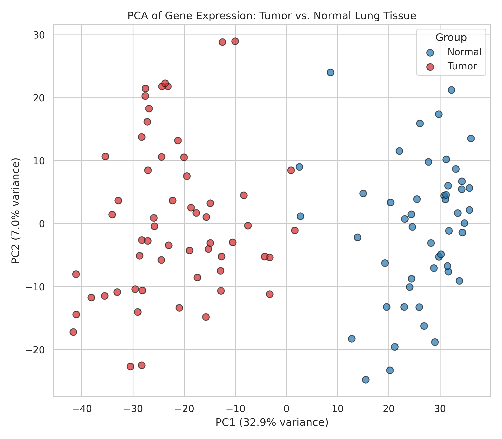
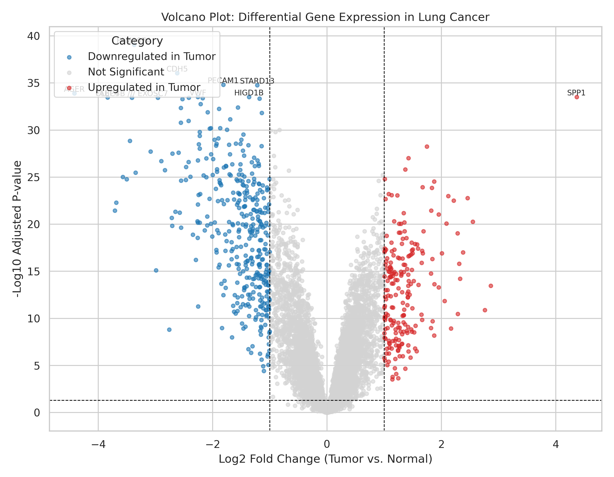
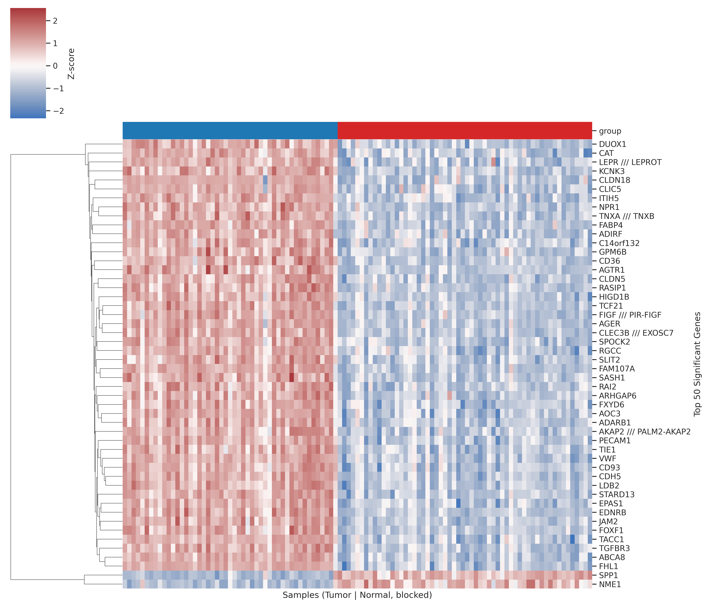
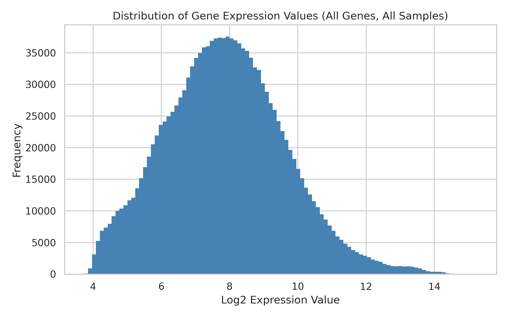
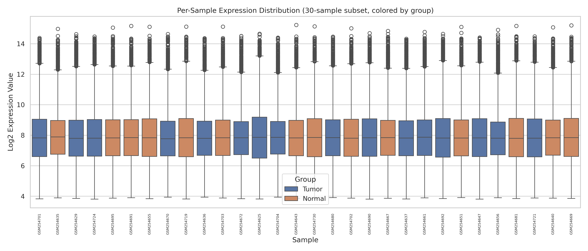

# Gene Expression Analysis of Lung Adenocarcinoma (GSE10072)

## Overview

This project presents a complete bioinformatics pipeline for differential gene expression analysis of lung adenocarcinoma using the publicly available **GSE10072** microarray dataset from the NCBI Gene Expression Omnibus (GEO). The analysis compares tumor tissue with adjacent normal lung tissue to identify significantly differentially expressed genes associated with lung cancer.

The entire workflow was implemented in **Google Colab** using Python and standard bioinformatics libraries, covering data acquisition, preprocessing, quality assessment, statistical analysis, visualization, and biological interpretation.

---

## Objectives

- Download and analyze a real-world public cancer gene expression dataset.
- Perform differential gene expression analysis between tumor and normal lung tissue.
- Identify statistically significant differentially expressed genes (DEGs).
- Visualize the results using publication-style figures.
- Interpret biologically relevant genes involved in lung cancer.
- Build a fully reproducible bioinformatics workflow suitable for research and graduate-level applications.

---

## Dataset

| Attribute | Details |
|-----------|---------|
| Dataset | GSE10072 |
| Database | NCBI Gene Expression Omnibus (GEO) |
| Platform | GPL96 – Affymetrix Human Genome U133A Array |
| Disease | Lung Adenocarcinoma |
| Samples | 107 Total |
| Tumor Samples | 58 |
| Normal Samples | 49 |

---

## Bioinformatics Workflow

The analysis pipeline consisted of the following steps:

1. Download the GSE10072 dataset using GEOparse.
2. Extract the expression matrix and sample metadata.
3. Remove missing values and Affymetrix control probes.
4. Assign tumor and normal labels from GEO metadata.
5. Confirm log2-transformed expression values.
6. Map Affymetrix probes to gene symbols.
7. Collapse multiple probes representing the same gene.
8. Perform exploratory data analysis (histograms and boxplots).
9. Conduct Principal Component Analysis (PCA).
10. Perform differential expression analysis using Welch's t-test.
11. Apply Benjamini–Hochberg False Discovery Rate (FDR) correction.
12. Generate volcano plot and clustered heatmap.
13. Interpret biologically significant genes.

---

# Methods

### Statistical Analysis

Each gene was tested independently using **Welch's two-sample t-test**, which does not assume equal variance between tumor and normal samples.

To correct for multiple hypothesis testing, **Benjamini–Hochberg False Discovery Rate (FDR)** correction was applied.

Genes were considered significantly differentially expressed if they satisfied:

- Adjusted p-value < 0.05
- |log2 Fold Change| > 1

---

# Results

After preprocessing and probe-to-gene mapping, **13,515 unique genes** were analyzed.

Using Welch's t-test followed by Benjamini–Hochberg FDR correction:

- **Total genes tested:** 13,515
- **Significantly differentially expressed genes:** **600**
- **Upregulated in tumor:** **210**
- **Downregulated in tumor:** **390**

Principal Component Analysis demonstrated separation between tumor and normal tissue samples based on genome-wide expression profiles, indicating substantial transcriptional differences between the two biological conditions.

The volcano plot highlighted genes with both large fold changes and strong statistical significance, while the clustered heatmap illustrated distinct expression patterns separating tumor samples from normal tissue.

---

# Biological Interpretation

The differentially expressed genes identified in this study are consistent with known molecular alterations associated with lung adenocarcinoma.

Genes involved in cell proliferation, extracellular matrix remodeling, angiogenesis, and loss of normal lung tissue identity are expected to show altered expression in tumor tissue. These biological processes represent well-established hallmarks of cancer, including uncontrolled cell division, invasion, and tissue remodeling.

Although this project is intended as a reproducible bioinformatics workflow rather than a novel biological discovery, the overall expression patterns are consistent with previously published lung cancer gene expression studies.

---

# Visualizations

The project includes several standard bioinformatics visualizations.

## Principal Component Analysis (PCA)



## Volcano Plot



## Heatmap of Top Differentially Expressed Genes



## Expression Distribution Histogram



## Sample-wise Boxplot



---

# Repository Note

To keep this repository lightweight and within GitHub's web upload limits, the intermediate files `expression_clean.csv` and `expression_raw_extracted.csv` are not included. These files are automatically generated when the notebook is executed using the publicly available GSE10072 dataset.

---

# Project Structure

```text
gene-expression-analysis-lung-cancer/
│
├── data/
│   └── processed/
│       ├── expression_gene_level.csv
│       ├── sample_metadata_labeled.csv
│       └── sample_metadata_raw.csv
│
├── notebooks/
│   └── gene_expression_analysis.ipynb
│
├── figures/
│   ├── histogram_expression.png
│   ├── boxplot_samples.png
│   ├── pca_plot.png
│   ├── volcano_plot.png
│   └── heatmap_top_genes.png
│
├── results/
│   ├── DEG_full_results.csv
│   └── DEG_significant_genes.csv
│
├── README.md
├── requirements.txt
├── LICENSE
└── .gitignore
```

---

# Technologies Used

- Python 3
- Google Colab
- GEOparse
- Pandas
- NumPy
- SciPy
- Statsmodels
- Scikit-learn
- Matplotlib
- Seaborn

---

# Installation

```bash
git clone https://github.com/ssri-m/gene-expression-analysis-lung-cancer.git

cd gene-expression-analysis-lung-cancer

pip install -r requirements.txt
```

---

# Running the Project

Open the notebook located in the `notebooks/` directory using **Google Colab** or **Jupyter Notebook**, then execute all cells sequentially.

The notebook automatically downloads the GSE10072 dataset from GEO, performs preprocessing, differential expression analysis, generates figures, and exports the final results.

---

# Future Improvements

Potential extensions of this project include:

- Gene Ontology (GO) enrichment analysis
- KEGG pathway enrichment analysis
- Validation using independent GEO datasets
- RNA-seq differential expression analysis using PyDESeq2
- Survival analysis using TCGA clinical datasets
- Machine learning models for cancer subtype classification

---

# References

- Barrett T, et al. NCBI Gene Expression Omnibus (GEO).
- Edgar R, Domrachev M, Lash AE. Gene Expression Omnibus: NCBI gene expression and hybridization array data repository.
- Landi MT, et al. Gene expression signature of cigarette smoking and lung adenocarcinoma.

---

# License

This project is distributed under the MIT License.
